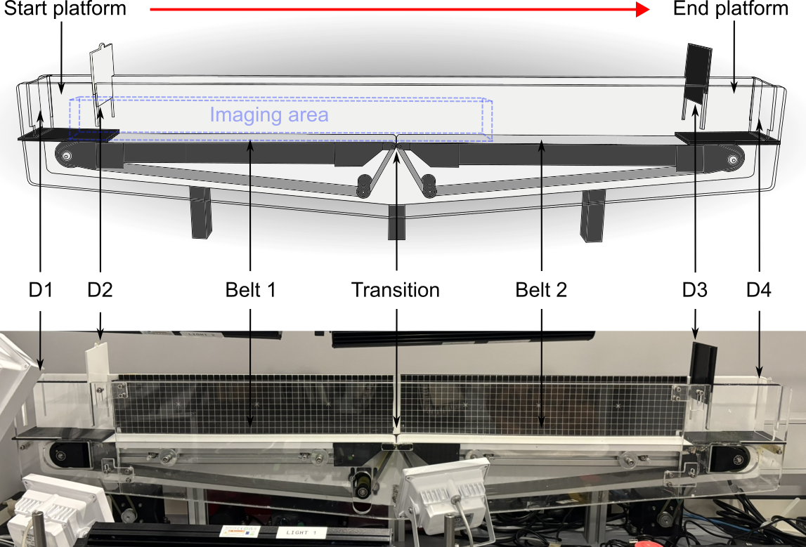

# APA Dual-Belt Travelator Analysis

<p align="center">
  <a href="media/labelling_demo.mp4">
    
  </a>
</p>



Code for the analysis pipeline described in:

**A Novel Mouse Paradigm for Anticipatory Postural Adjustments: Development and Behavioural Characterisation**

_Project is for personal use and needs some further cleanup and documentation..._

## Overview


This repository contains the full data processing and analysis pipeline for studying anticipatory postural adjustments (
APAs) in mice using a novel paradigm named the dual-belt travelator. The pipeline covers:

1. **Multi-camera labelling and calibration** - Tools for extracting video frames across three synchronised camera
   views (side, front, overhead), calibrating camera positions using visible fixed landmarks, and labelling body parts
   across camera views simultaneously with epipolar guidelines (now isolated as
   standalone [repo](https://github.com/HollyMorley/MultiCamLabelling) for future development)
2. **3D pose estimation** - Transformation of 2D DeepLabCut tracking coordinates into real-world 3D coordinates using
   camera calibration and triangulation
3. **Gait phase detection** - ML-based classification of limb stance/swing states using LightGBM
4. **Trial segmentation** - Automated identification of running trials and categorisation into phases (RunStart,
   Transition, RunEnd, etc.)
5. **Feature extraction** - Computation of kinematic and postural measures at the stride and run level
6. **Statistical analysis** - PCA, logistic regression, and LDA to characterise APA motor components, their learning
   dynamics, and context-specificity

## Pipeline

The pipeline is split into two executable notebooks:

- **`preprocessing/run_preprocessing.ipynb`** - full preprocessing pipeline from raw DLC output to analysis-ready data
- **`apa_analysis/run_analysis.ipynb`** - feature extraction and statistical characterisation

See `docs/Strides_Workflow` for further details on the trial identification and stride detection logic and
`docs/Pipeline2024` for further details on preprocessing workflow.

Below are the most important files for each stage of the pipeline, with descriptions.

### Labelling

| Script                               | Description                                                                                |
|--------------------------------------|--------------------------------------------------------------------------------------------|
| `labelling/MultiCamLabelling.py`     | Multi-camera frame extraction, calibration, and labelling GUI                              |
| `labelling/DLC_evaluation.py`        | Multi-camera tracking evaluator with frame extraction for DLC relabelling                  |
| `labelling/View_DLC_Labels.py`       | Single-camera viewer for overlaying DLC coordinates on video and saving frames for figures |
| `labelling/CompareDLCModels.py`      | Compare outputs of two DLC models                                                          |
| `labelling/ManualFrontCamLabeler.py` | Manual relabelling for shifted front camera markers                                        |

### Preprocessing

| Script                                  | Description                                                       |
|-----------------------------------------|-------------------------------------------------------------------|
| `preprocessing/DLCFileSorting.py`       | Organise DLC output files by experimental condition and camera    |
| `preprocessing/MappingRealWorld.py`     | Map 2D coordinates to 3D real-world space via triangulation       |
| `gait/GaitLabelling.py`                 | Interactive GUI for manual gait phase annotation                  |
| `gait/GaitFeatureExtraction.py`         | Extract features for gait classifier training                     |
| `gait/GaitClassification.py`            | Train LightGBM classifier for stance/swing detection              |
| `preprocessing/GetRunsAndLoco.py`       | Segment data into trials, running phases, and label stride phases |
| `preprocessing/CheckGoodRuns.py`        | Validate run quality (incomplete)                                 |
| `preprocessing/CheckRunAvailability.py` | Check data availability across conditions and mice for analysis   |
| `preprocessing/FinalPrep.py`            | Compile per-condition data files ready for apa analysis           |

### Analysis

| Script                                                          | Description                                                                  |
|-----------------------------------------------------------------|------------------------------------------------------------------------------|
| `apa_analysis/GetFeatures/BasicMeasures.py`                     | Orchestrate stride and run-level feature extraction                          |
| `apa_analysis/GetFeatures/MeasuresByStride.py`                  | Stride-level kinematic measures                                              |
| `apa_analysis/GetFeatures/MeasuresByRun.py`                     | Run-level behavioural measures                                               |
| `apa_analysis/Characterisation/MainAnalysis/Main.py`            | Main APA characterisation analysis (PCA, regression, clustering) - Chapter 3 |
| `apa_analysis/Characterisation/WhenAPA.py`                      | Stride-wise APA timing analysis - Chapter 4                                  |
| `apa_analysis/Characterisation/Learning.py`                     | Temporal learning curves and APA development - Chapter 5                     |
| `apa_analysis/Characterisation/CompareConditions_Regression.py` | Cross-condition regression comparisons - Chapter 6                           |

### Visualisation

| Script                                              | Description                                            |
|-----------------------------------------------------|--------------------------------------------------------|
| `visualisation-tools/make_cam_and_skeleton_vids.py` | Generate combined camera + 3D skeleton videos and GIFs |
| `visualisation-tools/3D_skeleton_image.py`          | Static 3D skeleton renders from pose data              |
| `visualisation-tools/save_image_from_video.py`      | Extract individual frames from video files             |
| `visualisation-tools/view_video.py`                 | Basic video playback viewer                            |

## Configuration

Experimental parameters, file paths, mouse metadata, and body part definitions are centralised in `helpers/config.py`.
Analysis settings (stride numbers, phases, regularisation, mouse subsets) are in `apa_analysis/config.py`.

## Environment

```bash
conda env create -f environment.yml
conda activate VideoAnalysis
```

Python 3.8+, see `environment.yml` for the full dependency list.
